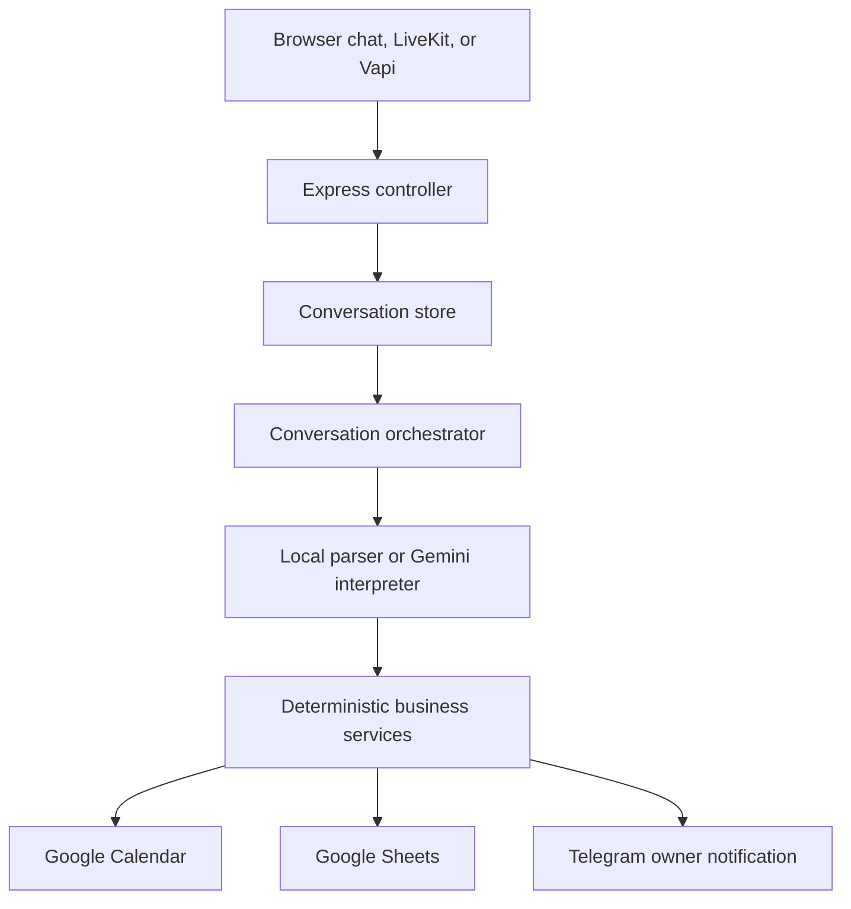

# Maple Street AI Receptionist

A TypeScript receptionist for Maple Street Dog Grooming. The same application supports browser chat, LiveKit browser voice, and the Vapi voice assistant. It answers business questions, manages appointments through Google Calendar, stores contacts and conversation outcomes in Google Sheets, and notifies the owner through Telegram when human judgment is required.

## System overview

| Channel            | Entry point                                                           | Conversation identity                            |
| ------------------ | --------------------------------------------------------------------- | ------------------------------------------------ |
| Browser chat       | `POST /conversations/messages`                                        | Server-generated or supplied `conversationId`    |
| LiveKit voice      | `POST /livekit/token`, then a direct call to the conversation handler | Server-created room and conversation ID          |
| Vapi voice         | `POST /vapi/conversations/messages`                                   | Trusted Vapi call ID                             |
| Call completion    | `POST /vapi/events`                                                   | Vapi `end-of-call-report`                        |
| LiveKit completion | Direct call to the conversation handler                               | Voice session disconnect or application shutdown |

All channels use the same conversation orchestrator and business services. Vapi and LiveKit handle transport, transcription, and speech; they do not duplicate the receptionist's business logic.

## Supported behavior

| Request                                      | Automated behavior                                                                             | Human handoff                                                |
| -------------------------------------------- | ---------------------------------------------------------------------------------------------- | ------------------------------------------------------------ |
| Services, prices, hours, breeds, vaccination | Answers from business configuration                                                            | Missing policy or safety judgment                            |
| Booking                                      | Checks the full service duration, offers nearby alternatives, confirms, then creates one event | Dog over 100 lb, safety concern, or no acceptable slot       |
| Rescheduling and cancellation                | Verifies customer and pet, enforces confirmation, then updates Calendar                        | Appointment starts within 24 hours                           |
| Running late                                 | Records and notifies delays under 15 minutes                                                   | Delay of 15 minutes or more                                  |
| Complaints                                   | Records routine feedback                                                                       | Refunds, charges, injuries, safety, or unresolved complaints |

The receptionist asks for one missing detail at a time. Customer-specific operations use a confirmed contact number rather than assuming the incoming caller number is the preferred contact number.

## How it works



1. The controller validates the request and resolves the business from trusted transport metadata.
2. The in-memory store creates or resumes the conversation.
3. Clear follow-up answers such as names, phone numbers, dates, times, and confirmations are parsed locally. Gemini handles natural-language intent and ambiguous meaning.
4. The orchestrator preserves collected facts and selects the next business operation or single follow-up question.
5. Deterministic services enforce pricing, safety, availability, confirmation, and handoff rules.
6. Calendar changes are checked immediately before writing. Contacts and final conversation outcomes are written to Sheets.
7. Ending a chat, LiveKit room, or Vapi call writes one Call Log row, then removes conversation state. A failed final write preserves state for retry.

## Key design decisions

| Decision                                                       | Reason                                                                                     |
| -------------------------------------------------------------- | ------------------------------------------------------------------------------------------ |
| One application core with HTTP, LiveKit, and Vapi adapters     | Keeps text and voice behavior consistent and independently testable                        |
| LLM for interpretation and final summaries only                | Business rules, confirmations, and external writes remain predictable                      |
| Business configuration collection                              | A new vendor can be added without rewriting controllers or workflows                       |
| Small interfaces around Calendar, Sheets, Gemini, and Telegram | Core tests use fakes and do not call live providers                                        |
| Business-local timezone with UTC persistence                   | Customers hear local times while external records remain unambiguous                       |
| Process-local conversation state and idempotency               | Keeps the current deployment simple; a production deployment would use durable storage     |
| One Call Log row per conversation                              | Captures all handled intents and the final outcome without logging every message as a call |
| Staged Vapi delay messages                                     | Acknowledges slow work at about 1.2, 5, and 12 seconds without replacing the final reply   |

## Run locally

Requirements: Node.js 22 or newer, Gemini access, a Google service account, a Google Sheet, a Google Calendar, and a Telegram bot/chat.

```bash
npm install
cp .env.example .env
npm run build
npm start
```

`npm start` loads `.env` and serves the chat at `http://localhost:3000`. For development with environment variables supplied by the shell or IDE, use `npm run dev`.

The required configuration is grouped by provider:

- Gemini: `GEMINI_API_KEY` and optional `GEMINI_MODEL`.
- Google: `GOOGLE_CLIENT_EMAIL`, `GOOGLE_PRIVATE_KEY`, `GOOGLE_SPREADSHEET_ID`, and `GOOGLE_CALENDAR_ID`.
- Telegram: `TELEGRAM_BOT_TOKEN` and `TELEGRAM_CHAT_ID`.
- Vapi: `VAPI_SERVER_TOKEN`, `VAPI_PHONE_NUMBER`, and `VAPI_BUSINESS_ID`.
- LiveKit browser voice: `LIVEKIT_URL`, `LIVEKIT_API_KEY`, and `LIVEKIT_API_SECRET`; optionally set `LIVEKIT_AGENT_NAME`. Voice and HTTP run in one Node process with one conversation store.

Enable the Google Sheets and Calendar APIs. Share the Sheet and Calendar with `GOOGLE_CLIENT_EMAIL`; Calendar access must allow event changes. Keep all credentials outside Git.

## Verification

```bash
npm run check
npm run build
```

Example end-to-end workflows:

1. In the browser chat, book or reschedule an appointment and show that the UI, Calendar event, Contacts row, and final Call Log row agree.
2. In the browser, click **Start voice** and complete a LiveKit multi-turn conversation. Verify that the spoken turns create the same Calendar/Sheets change or Telegram handoff as text.
3. In Vapi, complete a real multi-turn call, show a natural delayed acknowledgment when applicable, and verify the resulting Calendar/Sheets change or Telegram handoff.

Additional guides:

- [Architecture and request flow](docs/architecture.md)
- [Browser workflow guide](docs/demo.md)
- [LiveKit browser voice setup](docs/livekit-setup.md)
- [Vapi voice setup](docs/vapi-setup.md)
- [Confirmed business flows](.agents/skills/program-flow/references/requirements.md)

## Known scope limits

- Conversation state and duplicate-operation guards are in memory and do not survive a restart.
- The local Vapi setup uses an HTTPS tunnel; the application and tunnel must remain running.
- LiveKit voice runs inside the same Node.js process as the HTTP server; no agent worker or Redis service is required. The browser UI uses LiveKit's WebRTC microphone and speaker path, so the browser must be allowed to access the selected microphone.
- Holiday hours, payments, automatic refunds, and multi-location administration are outside the current scope.
