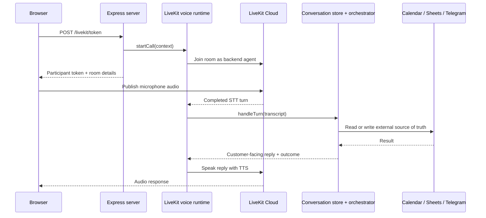

# Architecture and request flow

This document explains how the Maple Street receptionist moves a customer message from a browser, LiveKit voice session, or Vapi call to the deterministic business services.

## Runtime topology

The HTTP server, LiveKit voice runtime, in-memory conversation store, and receptionist services run in one Node.js process. LiveKit Cloud provides the room transport and hosted inference; it does not host the application's business logic.



There is no Redis service, internal HTTP round trip, agent worker, or child process in the LiveKit path.

## Application startup

`src/main.ts` creates these shared objects once:

1. `InMemoryConversationStore` keeps active conversations.
2. `ConversationOrchestratorResolver` creates the configured business services.
3. HTTP options register browser chat, LiveKit, and Vapi adapters.
4. `ConversationFinalizer` closes conversations that reach the idle timeout.
5. Shutdown closes active LiveKit calls and finalizes their conversations.

All channels resolve the same business configuration and orchestrator boundary. The channel adapter owns transport-specific details; the orchestrator owns customer-facing behavior and business decisions.

## HTTP entry points

| Endpoint                                  | Purpose                                                                                                                            |
| ----------------------------------------- | ---------------------------------------------------------------------------------------------------------------------------------- |
| `POST /conversations/messages`            | Browser text turn. Requires `X-Business-Id` and a JSON `message`.                                                                  |
| `POST /conversations/:conversationId/end` | Explicitly finalize a browser conversation and write one Call Log row.                                                             |
| `POST /livekit/token`                     | Validate the business, create the LiveKit room context, start the backend voice participant, and return the customer's room token. |
| `POST /vapi/conversations/messages`       | Receive a trusted Vapi turn and send the deterministic reply back to Vapi.                                                         |
| `POST /vapi/events`                       | Finalize Vapi calls from the end-of-call event.                                                                                    |

The business ID comes from trusted request metadata such as `X-Business-Id` or the Vapi configuration. Customer text cannot select a different business.

## LiveKit turn flow

The LiveKit integration is split into small responsibilities:

- `livekit-controller.ts` validates `/livekit/token`, creates a conversation ID and room context, starts the backend call, and returns only a room-scoped customer token.
- `voice-runtime.ts` tracks active calls, serializes completed turns, waits for pending work, and finalizes the call exactly once.
- `voice-connection.ts` joins the room directly using LiveKit room/session primitives. It configures Deepgram Nova 3 STT with Indian-English guidance and Inworld Ashley TTS through LiveKit Inference.
- `livekit-conversation-adapter.ts` converts a transcript into the existing conversation-handler input. It shares the in-memory store and does not call the HTTP server.
- `voice-reply.ts` speaks the exact reply returned by the orchestrator and disconnects after a customer end-call request.

Turn ordering is intentional: a new transcript waits for the previous turn to finish before the orchestrator sees it. This prevents overlapping writes and keeps the active booking state consistent.

The demo disables interruptions while the receptionist is speaking. The customer should wait until playback finishes before answering.

## Conversation and persistence flow

For each channel, the core flow is:

1. Resolve the business from trusted metadata.
2. Create or resume the conversation by business and conversation ID.
3. Parse unambiguous short answers locally, such as phone numbers, names, weights, dates, times, and confirmations.
4. Use Gemini for intent interpretation or ambiguous language only.
5. Preserve structured facts in the active request and ask for one missing field at a time.
6. Read the source of truth before answering: business configuration, Google Calendar, Google Sheets, or owner policy.
7. Perform external writes only after the required confirmation.
8. Return the deterministic reply to the channel.
9. On explicit end, voice disconnect, Vapi end-of-call, or idle timeout, write one Call Log row and remove the in-memory state after persistence succeeds.

Google Calendar stores appointments and availability. Google Sheets stores one contact row per confirmed contact number and one final Call Log row per conversation. Telegram receives owner handoffs when automation cannot safely complete the request.

## Booking rules

The booking flow requires these details before a Calendar write:

- service
- customer name
- confirmed contact phone number
- pet name
- dog weight
- rabies vaccination status
- requested date and time
- final customer approval of the summary

Breed, health, and behavior information is collected when it affects safe scheduling. A contact number is normalized to the configured Indian E.164 format before confirmation and persistence.

Maple Street is open Monday through Saturday from 9:00 AM to 5:00 PM in `Asia/Calcutta`. The requested service must fit completely inside those hours. For example, a two-hour Full Groom cannot start at 6:00 PM; the latest valid start is 3:00 PM.

Closed-day and out-of-hours requests are handled separately from Calendar conflicts. The receptionist explains the configured hours or the latest possible service start, then offers actual available Calendar slots. A Calendar conflict keeps the normal nearest-alternative flow. Nothing is booked until the customer accepts an available slot and confirms the final summary.

If the request needs human judgment—such as an oversized dog, safety concern, unavailable exact-time-only request, or failed external write—the customer is told that the request needs review and the owner receives a Telegram handoff. The assistant never claims an appointment was booked unless the booking service returns a created appointment ID.

## Owner notifications

Booking and pricing handoffs use safe plain text rather than Telegram parse mode, so customer names and reasons containing punctuation cannot break formatting. The message has:

- an alert header
- business and conversation context
- customer and appointment details
- a separated reason section

Example:

```text
🚨 APPOINTMENT BOOKING REVIEW

Business: Maple Street Dog Grooming
Conversation: livekit-example

Customer: Alex Morgan
Contact phone: +919876543210
Pet: Milo
Weight: 50 lb
Service: Full Groom
Requested time: Monday, September 14 at 6:00 PM GMT+5:30

Reason: The requested time is outside our business hours.
```

Bot credentials and the target chat ID are read from application configuration. They are never hard-coded or accepted from customer messages.

## Configuration and local run

Copy the template and keep the resulting file outside Git:

```bash
cp .env.example .env
npm install
npm run dev
```

Required provider settings are documented in `.env.example`:

- Gemini: `GEMINI_API_KEY`, optional `GEMINI_MODEL`
- Google: `GOOGLE_CLIENT_EMAIL`, `GOOGLE_PRIVATE_KEY`, `GOOGLE_SPREADSHEET_ID`, `GOOGLE_CALENDAR_ID`
- Telegram: `TELEGRAM_BOT_TOKEN`, `TELEGRAM_CHAT_ID`
- LiveKit Cloud: `LIVEKIT_URL`, `LIVEKIT_API_KEY`, `LIVEKIT_API_SECRET`, optional `LIVEKIT_AGENT_NAME`
- Vapi: `VAPI_SERVER_TOKEN`, `VAPI_PHONE_NUMBER`, `VAPI_BUSINESS_ID`

Start the browser demo at `http://localhost:3000`. When LiveKit variables are configured, click **Start voice**. The browser needs microphone permission and the backend needs outbound access to LiveKit Cloud.

## Verification

Run the static checks and build before submitting:

```bash
npm run check
npm run build
```

For a manual demo, verify at least:

1. A normal booking creates one Calendar event, updates Contacts, and returns an appointment ID.
2. A 6:00 PM Full Groom request explains the hours and offers real alternatives without creating an event.
3. A rejected phone number or name does not silently continue to booking.
4. An exact-time-only conflict creates a human handoff instead of repeatedly offering slots.
5. A customer saying goodbye ends the voice call after the farewell and writes one Call Log row.
6. The Telegram message is readable and contains the request reason without exposing credentials.

Conversation state and duplicate-operation guards are process-local for this demo. A multi-instance production deployment would need durable conversation storage and idempotency records.
