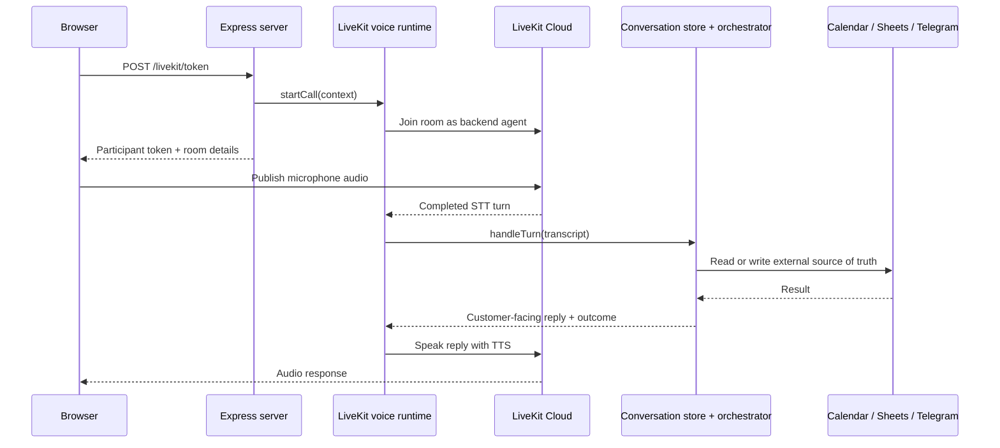
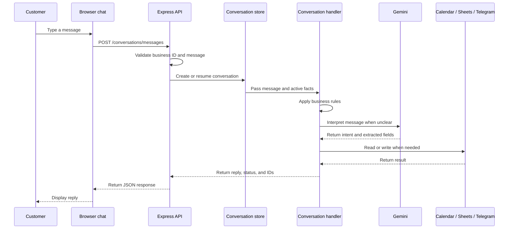

# How the app works

This document explains the main idea and technical details behind the browser chat, LiveKit voice demo, Vapi calls, Calendar, Sheets, and Telegram.

## In one minute

The customer can type or speak. The request reaches one receptionist core that:

1. understands the request;
2. asks for missing details one at a time;
3. checks the business rules and Google Calendar;
4. creates or changes an appointment only after confirmation; and
5. saves the result to Google Sheets or sends the owner a Telegram message when human help is needed.

The browser chat, LiveKit voice demo, and Vapi phone assistant all use this same core. This keeps the behavior consistent across channels.

The most important design choice is simple: the HTTP server and LiveKit voice code run in the same Node.js process.

## One app process

The HTTP server, LiveKit voice runtime, in-memory conversation store, and receptionist services run in one Node.js process. LiveKit Cloud provides the room transport and hosted inference; it does not host the application's business logic.



The diagram shows the full path: audio is handled by LiveKit, but the business decision is made by the same receptionist core used by text chat.

## What happens when the app starts

`src/main.ts` creates these shared objects once:

1. `InMemoryConversationStore` keeps active conversations.
2. `ConversationOrchestratorResolver` creates the configured business services.
3. HTTP options register browser chat, LiveKit, and Vapi adapters.
4. `ConversationFinalizer` closes conversations that reach the idle timeout.
5. Shutdown closes active LiveKit calls and finalizes their conversations.

All channels use the same business configuration and receptionist logic. Each channel adapter only translates its own input and output format.

## Main endpoints

| Endpoint                                  | Purpose                                                                                                                            |
| ----------------------------------------- | ---------------------------------------------------------------------------------------------------------------------------------- |
| `POST /conversations/messages`            | Browser text turn. Requires `X-Business-Id` and a JSON `message`.                                                                  |
| `POST /conversations/:conversationId/end` | Explicitly finalize a browser conversation and write one Call Log row.                                                             |
| `POST /livekit/token`                     | Validate the business, create the LiveKit room context, start the backend voice participant, and return the customer's room token. |
| `POST /vapi/conversations/messages`       | Receive a trusted Vapi turn and send the deterministic reply back to Vapi.                                                         |
| `POST /vapi/events`                       | Finalize Vapi calls from the end-of-call event.                                                                                    |

The business ID comes from trusted request metadata such as `X-Business-Id` or the Vapi configuration. Customer text cannot select a different business.

## How browser chat works



1. The chat UI sends the customer's latest message to `POST /conversations/messages` with the trusted `X-Business-Id` header.
2. The server creates a conversation ID for the first message. The UI keeps that ID and sends it with every later message.
3. The conversation store keeps the current facts, such as the customer, pet, service, and requested time.
4. The conversation handler understands the message, checks the business rules and external services when needed, and returns the next reply.
5. The server returns the reply, status, conversation ID, and appointment ID when a Calendar change succeeds. The UI only displays the result; it does not contain business rules.
6. When the customer ends the chat, the server writes one Call Log row and removes the conversation from memory.

## How a LiveKit voice call works

The LiveKit integration has a few focused parts:

- `livekit-controller.ts` validates `/livekit/token`, creates a conversation ID and room context, starts the backend call, and returns only a room-scoped customer token.
- `voice-runtime.ts` tracks active calls, serializes completed turns, waits for pending work, and finalizes the call exactly once.
- `voice-connection.ts` joins the room directly using LiveKit room/session primitives. It configures Deepgram Nova 3 STT with Indian-English guidance and Inworld Ashley TTS through LiveKit Inference.
- `livekit-conversation-adapter.ts` sends each transcript to the same conversation handler used by chat and uses the shared conversation store directly.
- `voice-reply.ts` speaks the receptionist's response to the customer and ends the LiveKit call when the customer asks to end it.

One voice turn finishes before the next one is handled. This prevents two answers from changing the same booking at the same time.

The demo disables interruptions while the receptionist is speaking. The customer should wait until playback finishes before answering.

## How a customer request is handled

For each channel, the core flow is:

1. Resolve the business from trusted metadata.
2. Create or resume the conversation by business and conversation ID.
3. Parse clear short answers locally, such as phone numbers, names, weights, dates, times, and confirmations.
4. Use Gemini for intent interpretation or unclear language only.
5. Preserve structured facts in the active request and ask for one missing field at a time.
6. Check the right source before answering: business settings, Google Calendar, Google Sheets, or owner policy.
7. Perform external writes only after the required confirmation.
8. Return the deterministic reply to the channel.
9. On explicit end, voice disconnect, Vapi end-of-call, or idle timeout, write one Call Log row and remove the in-memory state after persistence succeeds.

Google Calendar stores appointments and availability. Google Sheets stores one contact row per confirmed contact number and one final Call Log row per conversation. Telegram receives owner handoffs when the receptionist cannot safely complete the request.

## Booking behavior

The booking flow requires these details before a Calendar write:

- service
- customer name
- confirmed contact phone number
- pet name
- dog weight
- rabies vaccination status
- requested date and time
- final customer approval of the summary

A contact number is normalized to the configured Indian E.164 format before confirmation and persistence.

Maple Street is open Monday through Saturday from 9:00 AM to 5:00 PM in `Asia/Calcutta`. The requested service must fit completely inside those hours. For example, a two-hour Full Groom cannot start at 6:00 PM; the latest valid start is 3:00 PM.

Closed-day and out-of-hours requests are handled separately from Calendar conflicts. The receptionist explains the configured hours or the latest possible service start, then offers actual available Calendar slots. A Calendar conflict keeps the normal nearest-alternative flow. Nothing is booked until the customer accepts an available slot and confirms the final summary.

If the request needs human judgment—such as an oversized dog, safety concern, unavailable exact-time-only request, or failed external write—the customer is told that the request needs review and the owner receives a Telegram handoff. The assistant never claims an appointment was booked unless the booking service returns a created appointment ID.

## Human handoffs and exception scenarios

The receptionist uses `needs_human` when it cannot safely make the decision automatically. It records the reason, preserves the conversation details, notifies the owner, and tells the customer that the owner will call back. It never confirms a booking before Calendar returns a successful appointment ID.

### Safety or aggressive behavior

Aggressive dog behavior, severe anxiety, active illness, injury, or another unclear safety concern is sent to the owner for review. The receptionist does not promise that the service is suitable, provide an automatic booking, or make a safety decision. It collects a confirmed callback number and the available customer and pet details before notifying the owner.

### Booking conflict

The receptionist checks Calendar again immediately before creating an appointment. If the requested time is no longer available, it does not create an event. It offers real available times on the same day, then the next open day.

- If the customer accepts an alternative, the receptionist repeats the final details, waits for confirmation, and creates the appointment.
- If the customer rejects the alternatives but is open to another time, it asks for another date or time and searches again.
- If the requested time is the customer's only option, the request is sent to the owner instead of repeating alternatives.
- If no suitable time is found in the search window, the receptionist collects callback details and sends a human handoff.

### When rescheduling is allowed

The receptionist identifies the existing appointment, checks the requested new slot, and asks for confirmation before changing Calendar. Automatic rescheduling is allowed only when the appointment is more than 24 hours away and the new slot is available. If the new slot conflicts, it offers nearby available times and makes no change until one is accepted.

Rescheduling within 24 hours, past appointments, or unscheduled appointments goes to the owner. Calendar or save errors also go to the owner, and the receptionist never claims the change succeeded.

## Messages sent to the owner

Booking and pricing handoffs include:

- handoff type
- business and conversation ID
- customer name and contact phone
- pet name and weight
- service and requested time
- reason for the handoff

## How to run it locally

Provide the required environment variables in the terminal, or create a local `.env` file using `.env.example` as a reference. Keep the `.env` file outside Git.

```bash
npm install
npm run dev
```

Required provider settings are documented in `.env.example`:

- Gemini: `GEMINI_API_KEY`, optional `GEMINI_MODEL`
- Google: `GOOGLE_CLIENT_EMAIL`, `GOOGLE_PRIVATE_KEY`, `GOOGLE_SPREADSHEET_ID`, `GOOGLE_CALENDAR_ID`
- Telegram: `TELEGRAM_BOT_TOKEN`, `TELEGRAM_CHAT_ID`
- LiveKit Cloud: `LIVEKIT_URL`, `LIVEKIT_API_KEY`, `LIVEKIT_API_SECRET`, optional `LIVEKIT_AGENT_NAME`
- Vapi: `VAPI_SERVER_TOKEN`, `VAPI_PHONE_NUMBER`, `VAPI_BUSINESS_ID`

Start the browser demo at `http://localhost:3000`. When LiveKit variables are configured, click **Start voice**. The browser needs microphone permission and the backend needs outbound access to LiveKit Cloud.
